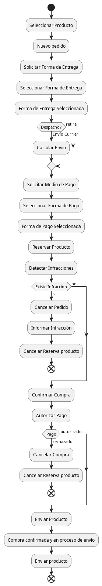

# Trabajo Práctico: "Livre Markket: Comunidad de vendedores y compradores de bienes y/o servicios"

## Descripción del Negocio
Livre Markket es una plataforma de comercio electrónico que conecta a vendedores y compradores de productos y servicios. Los vendedores pueden publicar sus productos, mientras que los compradores buscan, seleccionan y adquieren estos productos mediante un flujo de compra que incluye verificación de cumplimiento de políticas, reserva de productos, validación de pagos y selección de envíos.

## Módulos y Responsabilidades
1. **Web**: Gestiona la interfaz de usuario y maneja la interacción directa con los usuarios (vendedores y compradores), permitiendo realizar búsquedas, visualización de productos y gestión de perfil.
2. **Compras**: Actúa como el concentrador de las operaciones entre el comprador y los servicios internos, coordinando el flujo de transacción.
3. **Envíos**: Calcula costos de envío (dependiendo de si es retiro o envío por correo) y gestiona la logística del envío de productos.
4. **Infracciones**: Evalúa el cumplimiento de las políticas de publicación y detecta posibles infracciones por parte de compradores o vendedores.
5. **Pagos**: Servicio de pago que autoriza o rechaza transacciones.
6. **Publicaciones**: Administra los productos o servicios publicados y gestiona la reserva de los mismos durante el proceso de compra.

## Parte 1: Arquitectura Monolítica Inicial
La primera implementación de Livre Markket emplea una arquitectura **monolítica sincrónica**. Todos los módulos están alojados en una única aplicación, compartiendo recursos y manteniendo una sola base de datos centralizada. Los usuarios interactúan directamente con la aplicación a través del módulo Web, que controla el flujo completo de la compra sincrónicamente, siguiendo estos pasos:

- El comprador selecciona un producto y genera una solicitud de compra.
- La aplicación realiza llamadas secuenciales a los módulos internos (Publicaciones, Infracciones, Envíos y Pagos).
- Si todas las verificaciones son satisfactorias, se confirma la compra y se despacha el producto.

La primer versión de la implementación monolítica respeta el siguiente diagrama de actividades para la transacción de comprar:

En el repositorio git de la asignatura se encuentra la versión base implementada para simular el servidor de **compras**

### Desafíos de la Arquitectura Monolítica
- **Escalabilidad limitada**: Dificultad para escalar módulos individuales.
- **Dependencias fuertes**: La modificación de un módulo impacta a todo el sistema.
- **Baja tolerancia a fallos**: Cualquier fallo en un módulo detiene todo el proceso.

## Actividades propuestas:
1. **Arquitectura**: realizar una descripción de la arquitectura desde la perspectiva de gestión de las comunicaciones. Describa el stack tecnológico utilizado y evalúe las técnicas de programación utilizadas. Por ejemplo: estructurado u orientado a objetos, declarativo o imperativo, jerárquico o modular, etc.
2. **Lógica**: describa la lógica representada en el diagrama de actividades y realice un detalle de las reglas de negocio que se implementan.
3. **Desafíos**: Además de los 3 desafío indicados en la sección anterior, enumere que otros inconvenientes encuentra tanto en el código cómo en la arquitectura planteada. Recuerde lo aprendido en Laboratorio de Programación y Lenguajes.
4. **Refactoring**: enumere al menos 3 actividades de refactoring que llevaría sobre el código, si lo cree necesario fundamente a través de los patrones de refactoring.
5. **Re-ingeniería**: Realice una propuesta, pensando en lo visto en la asignatura hasta este momento de cambios arquitectónicos para superar los desafíos indicados en el punto 3.

---
# Evoluciones Arquitectónicas en la Transacción de Compra
---
# Parte 2: 

## Evolución 1: Sincronía con Paralelización de Tareas
1. **Objetivo**: Mejorar la eficiencia de la compra permitiendo que ciertas operaciones se realicen en paralelo.
2. **Implementación**: Permitir que la solicitud de reserva del producto, la verificación de infracciones, la selección de forma de pago y la selección de forma de envío se ejecuten al mismo tiempo, minimizando tiempos de espera.
3. **Desafíos y Ventajas**:
   - Reducción del tiempo total de transacción.
   - Aumento de complejidad en la coordinación de respuestas.

### Actividades propuestas:
1. **Nuevo diagrama de Actividades**: Usando la herramienta [plantUML](https://plantuml.com/es/) y el fuente inicial de la arquitectura monolítica secuencial, adapte la misma en una nueva versión que contemple la paralelización de actividades. Para ello deberá primero identificar todos los punto de paralelización posibles. 
2. **1º Evolución del código**: realice todos los cambios que crea necesario para realizar la paralelización sugerida en el punto 1. *Sugerencia*: utilice el módulo setTimeout de [nodejs](https://nodejs.org/en), en particular es importante paralelizar las actividades de acuerdo a la arquitectura asincrónica de javascript, en particular al motor de nodejs, especialmente lo que se refiere al event loop. A continuación se facilitan algunos links para ampliar: 
   - [Node.js Architecture: Understanding Node.js Architecture](https://medium.com/@ibrahimlanre1890/node-js-architecture-understanding-node-js-architecture-5fb32879b994)
   - [Introduction to Node.js](https://nodejs.org/en/learn/getting-started/introduction-to-nodejs)
   - [Asynchronous flow control](https://nodejs.org/en/learn/asynchronous-work/asynchronous-flow-control)
   - [Node.js Architecture](https://radixweb.com/nodejs-architecture)
3. **Descripción de la arquitectura nodejs** en función de lo aprendido en el punto 2, realice un resumen de la arquitectura no bloqueante y de eventloop de nodejs (javascript asincrónico) y comente a su criterio porqué cree que es tema de la asignatira (realice correlación de los temas vistos hasta el momento).
4. **Despliegue y pruebas**: realice conclusiones respecto de la diferencia de ejecución entre la versión cero monolítica secuencial y esta nueva versión monolítica asincrónica.

---
# Parte 3:

## Evolución 2: Descomposición en Módulos RESTful
1. **Objetivo**: Transicionar la arquitectura monolítica hacia una **arquitectura de servicios RESTful** donde cada módulo es independiente.
2. **Implementación**: Desplegar cada módulo como un servicio REST, de manera que el módulo de Compras actúe como orquestador, realizando llamadas a cada servicio de forma sincrónica.
3. **Desafíos**:
   - Complejidad en la gestión de fallos, ya que si un servicio no responde, se detiene la transacción completa.

### Actividades propuestas:
1. **Evolución con servidor Web y Compras**: Realice una transición del diagrama de actividades incorporando solamente el servidor web que interactúa con el usuario.
2. **2º Evolución del código**: Modifique el código existente distribuyendo la lógica de negocio entre el servidor web que interactúa con el usuario y en principio selecciona un producto a comprar y responde a seleccionar el medio de pago y la forma de envío. Cómo la propuesta es usando un esquema de comunicación HTTP, se sugiere utilizar para la implementación los módulos:
   - [expressjs](https://expressjs.com/) para administrar los requerimientos HTTP
   - [Axios](https://axios-http.com/es/)
3. **Despliegue y validación**: realice un despliegue de lo realizado y revise lo que sucede en la ejecución. Indique que pasa y que desafíos o inconvenientes se presentan. Que pasa con el esquema de comunicación? cómo sucede? Realice una propuesta de mejoras a tener en cuenta.
4. **Arquitectura distribuida**: Realice una nueva evolución del diagrama, incorporando todos los servicios propuestos (envíos, infracciones, pagos y publicaciones...además de web y compras ya evolucionados) y realice un resumen ejecutivo de las responsabilidades de cada servicio,  indicando, según lo visto hasta ahora en la signatura, qué factores y técnicas deberían intervenir para el análisis. ¿Qué pasa con el esquema de comunicaciones?
5. **Modificación de Arquitectura**: realice todas las modificaciones en docker-compose para la nueva versión de la arquitectura.
6. **3º Evolución del código**: Incorpore ahora toda la distribución con todos los servidores propuestos utilizando HTTP cómo mecanismos de comunicación.
7. **Despliegue y validación**: ejecute la simulación y evalúe lo que pasa en esta nueva versión. ¿Qué inconvenientes se observan? realice un resumen de los desafíos y una propuesta para solucionarlos. ¿Es asincrónico el código?
8. **4º Evolución del código**: Refactoring y solución de los problemas de comunicación. Realice las modificaciones pertinentes para que efectivamente las interacciones de comunicación entre los servidores sean independientes y en paralelo. ¿Qué mecanismo visto en teoría se debe implementar?

---
# Parte 4:

## Evolución 3: Comunicación Asincrónica mediante Mensajería Distribuida
1. **Objetivo**: Hacer la arquitectura más robusta mediante la comunicación **asincrónica**, utilizando un sistema de mensajería que permita una arquitectura con "smart endpoint and dumb pipes".
2. **Implementación**: Configurar los servicios de Envíos, Pagos e Infracciones para que reciban mensajes de Compras y respondan de manera asincrónica, permitiendo la disponibilidad de todos los módulos incluso si uno de ellos falla momentáneamente.
3. **Desafíos**:
   - Coordinación de mensajes y procesamiento de respuestas en tiempos diferentes.
   - Cambios en la lógica de Compras para manejar respuestas de múltiples servicios en paralelo.

## Actividades propuestas:
1. **Mirando en perspectiva**: Evalúe lo realizado hasta aquí y resuma las técnica vistas usadas hasta el momento. ¿Que está pasando con mi sistema en esta situación? ¿Qué calidad de servicio se está brindando? enumere nuevamente los desafíos y realice las propuestas respectivas para la nueva evolución del código.

---
# Parte 5:

## Evolución 4: Asincronía con Desdoblamiento de Mensajes y Coreografía Mediante Broker
1. **Objetivo**: Mejorar la administración de mensajes y centralizar su distribución mediante un **broker de mensajería** (ej. RabbitMQ o Kafka).
2. **Implementación**: Configurar colas específicas para cada evento y establecer flujos coreografiados donde los servicios reaccionan ante eventos sin la necesidad de una orquestación central.
3. **Desafíos**:
   - Implementación de lógica distribuida y configuración avanzada del broker.
   - Sincronización y consistencia de los datos debido a la independencia de cada servicio en el flujo coreografiado.

## Actividades propuestas:
1. **Arquitectura con RabbitMQ**: Proponga que adaptaciones habría que realizar en la Arquitectura (usando docker) para contener ahora además un servidor de RabbitMQ.
2. **Implementando Arquitectura** Implemente las modificaciones propuestas en el punto 1 y verifique los resultados.
3. **Cambio del esquema de comunicaciones**: realice un resumen de los principales cambios requeridos para pasar de una comunicación punto a punto con express y axios a una comunicación mediante broker con RabbitMQ.
4. **6º Evolución del código**: implemente todos los cambios requeridos para pasar de la comunicación punto a punto a una comunicación con concentrador.
5. **Despliegue y validación**: realice la puesta en marcha y compruebe el nuevo funcionamiento. ¿Qué cambios se observan? ¿que mejoras se logran? ¿que pasa con la tolerancia fallos?
6. **7º Evolución del Código SAGAS**: Si bien a esta altura las comunicaciones cuentan con mensajería desdoblada y asincrónica, revise el negocio y genere un nuevo código más robusto y tolerante a fallos, no sólo desde la perspectiva de la infraestructura sino además desde la perspectiva del negocio, produciendo un código con recuperación total. 
7. **Documentación transaccional**: Realice el resumen de todo el flujo transaccional con su flujo positivo y todo el esquema de transacciones compensatorias requeridos. Realice una conclusión respecto de la complejidad y de la mantenibilidad y realice una prepuesta que mejore los desafíos planteados.
8. **8º Evolución del código CQRS**: realice una propuesta de implementación de "Command Query Responsibility Segregation" para evaluar que pasa con una compra determinada en cada servidor. A esta altura muy probablemente ya haya implementado un mecanismo de persistencia de las compras en cada servidor. Sii no lo ha realizado, es momento de hacerlo.
9. **Recapitulación**: Realice una evaluación de lo realizado hasta ahora y determine y describa todo lo que estaría haciendo falta para llegar a una aplicación de uso profesional.

---
# Parte 6:

## Evolución 5: Migración a ESB con Orquestación Mediante BPM/BPEL
1. **Objetivo**: Integrar un **Bus de Servicios Empresariales (ESB)** para centralizar y controlar el flujo de mensajes mediante orquestación.
2. **Implementación**: Configurar un motor BPM o BPEL que gestione la orquestación de cada paso en la compra, permitiendo reglas de negocio avanzadas y un manejo centralizado de los servicios.
3. **Desafíos**:
   - Complejidad en el mantenimiento y escalabilidad de la arquitectura.
   - Configuración de políticas de enrutamiento en el ESB para maximizar eficiencia y minimizar latencias.

## Actividades propuestas:
1. **Arquitectura con ESB**: Proponga que adaptaciones habría que realizar en la Arquitectura (usando docker) para contener ahora además un servidor ESB. Se propone usar [WSO2 Enterprise Integrator](https://ei.docs.wso2.com/en/latest/)
2. **Implementando Arquitectura** Implemente las modificaciones propuestas en el punto 1 y verifique los resultados.
3. **Cambio del esquema de comunicaciones**: realice un resumen de los principales cambios requeridos para pasar de una comunicación mediante broker con RabbitMQ a una orquestación con concentrador usando ESB. Es importante no proponer usar ESB cómo si fuera un broker (coreografía) sino cómo orquestador.
4. **9º Evolución del código BPM**: Si bien WSO2 no soporta de forma estándar el concepto de orquestación mediante BPM o BPEL, utilice los mecanismos estándar para transferir la lógica de coordinación que estaba (especialmente en compras) distribuida entre los servidores a un orquestador centralizado.
5. **Despliegue y validación**: realice la puesta en marcha y compruebe el nuevo funcionamiento. ¿Qué cambios se observan? ¿que mejoras se logran? ¿que pasa con la tolerancia fallos?
6. **Implementando Seguridad**: Realice una propuesta para incorporar esquema de comunicaciones y ejecución segura con autenticación, autorización y no repudio.
7. **10º Evolución del código**: Implemente los cambios propuestos en el punto anterior.
8. **Recapitulación**: realice una puesta en valor de todo lo realizado hasta el momento y nuevamente evalúe que otros aspectos estarían faltando para poder desplegar una aplicación profesional.
9. **Conclusiones finales**: realice un resumen de todo lo actuado y resuma los desafíos resueltos y las complejidades de los sistemas distribuidos orientados a los servicios.